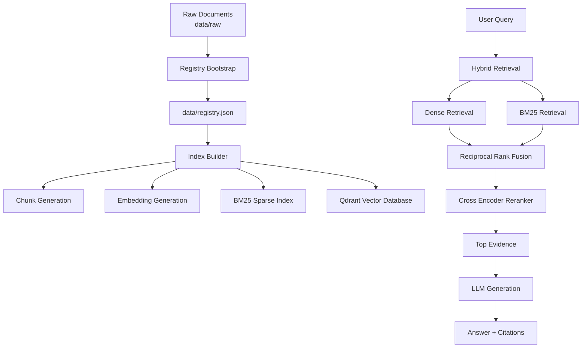

# Hybrid RAG Engine

A production-oriented Retrieval-Augmented Generation (RAG) system built around hybrid retrieval, combining dense semantic search, BM25 lexical retrieval, reciprocal rank fusion, cross-encoder reranking, and grounded LLM generation.

The project focuses on building a reproducible, inspectable, and deployable RAG pipeline rather than only connecting a language model to a vector database.

---

# Overview

Many RAG systems rely on a single retrieval strategy, commonly vector similarity search.

While dense retrieval is effective for semantic understanding, it can miss:

* exact terminology
* identifiers
* technical keywords
* lexical matches

This project implements a hybrid retrieval architecture combining:

* Dense semantic retrieval
* BM25 sparse retrieval
* Reciprocal Rank Fusion (RRF)
* Cross-encoder reranking
* Evidence-grounded generation

The final system exposes the RAG pipeline through FastAPI, provides an inspection interface through Streamlit, and runs using Docker Compose.

---

# Architecture



---

# Features

## Retrieval

* Hybrid retrieval architecture:

  * Dense semantic retrieval
  * BM25 lexical retrieval
  * Reciprocal Rank Fusion

* Cross-encoder reranking for improved evidence selection

## Data Pipeline

* Document ingestion workflow
* Document registry tracking
* Configurable chunking strategies
* Separate indexing and serving lifecycle

## Application Layer

* FastAPI inference service
* Streamlit inspection interface
* Environment-based configuration
* Docker Compose deployment

## Evaluation

Evaluation tooling covering:

* Retrieval quality
* Evidence relevance
* Answer correctness
* Failure analysis

---

# Engineering Highlights

## Reproducible Corpus Lifecycle

The project separates corpus management into explicit stages.

```text
Raw Documents
      |
      v
Registry Bootstrap
      |
      v
Document Registry
      |
      v
Index Building
      |
      +--> Chunks
      |
      +--> Embeddings
      |
      +--> Qdrant Collection
      |
      +--> BM25 Index
```

This prevents expensive processing from happening implicitly during application startup.

---

## Separate Indexing From Serving

The application does not rebuild indexes when the API starts.

Instead:

* document processing is performed explicitly
* indexes are created through controlled workflows
* serving remains predictable

---

## Service-Oriented Deployment

The system runs as separate services:

```text
                +-------------+
                | Streamlit   |
                +-------------+
                       |
                       |
                       v

                +-------------+
                |  FastAPI    |
                +-------------+
                       |
                       |
          +------------+------------+
          |                         |
          v                         v

   +-------------+          +-------------+
   |   Qdrant    |          |  LLM Server |
   | Vector DB   |          | LM Studio   |
   +-------------+          +-------------+
```

Docker Compose provides:

* service discovery
* isolated environments
* reproducible deployment

---

# Tech Stack

| Component        | Technology            |
| ---------------- | --------------------- |
| API              | FastAPI               |
| UI               | Streamlit             |
| Vector Database  | Qdrant                |
| Dense Retrieval  | Sentence Transformers |
| Sparse Retrieval | BM25                  |
| Reranking        | Cross Encoder         |
| Generation       | LM Studio / Gemini    |
| Configuration    | Pydantic Settings     |
| Deployment       | Docker Compose        |
| Testing          | Pytest                |

---

# Repository Structure

```text
.
├── src/
│   └── rag/
│       ├── api/
│       ├── ingestion/
│       ├── retrieval/
│       ├── generation/
│       ├── evaluation/
│       ├── vector_store/
│       └── ui/
│
├── scripts/
│   ├── bootstrap_registry.py
│   └── build_index.py
│
├── data/
│   ├── raw/
│   │   └── source documents
│   │
│   └── registry.json
│       └── corpus metadata manifest
│
├── Dockerfile
├── docker-compose.yml
├── requirements.txt
└── .env.example
```

Generated artifacts such as retrieval indexes and vector database storage are not stored in the repository.

---

# Getting Started

## Prerequisites

Required:

* Docker Desktop
* Git

Optional:

* LM Studio for local LLM inference

---

# Clone Repository

```bash
git clone https://github.com/Ammar-KDR/hybrid-rag-engine.git

cd hybrid-rag-engine
```

---

# Configure Environment

Create your environment file:

```bash
cp .env.example .env
```

Example configuration:

```env
QDRANT_URL=http://qdrant:6333
QDRANT_COLLECTION=documents

LM_STUDIO_BASE_URL=http://host.docker.internal:1234/v1
LM_STUDIO_MODEL=qwen/qwen3-4b-2507
```

---

# Initialize the Corpus

The ingestion lifecycle contains two explicit stages.

## 1. Bootstrap Registry

The registry stores document metadata including:

* document identifiers
* filenames
* file types
* ingestion metadata
* chunking information

Run:

```bash
docker compose run --rm api python scripts/bootstrap_registry.py
```

This creates:

```text
data/registry.json
```

---

## 2. Build Retrieval Indexes

The index builder creates:

* document chunks
* embeddings
* Qdrant vectors
* sparse retrieval data

Run:

```bash
docker compose run --rm api python scripts/build_index.py
```

---

# Run the Application

Start all services:

```bash
docker compose up
```

The stack contains:

```text
FastAPI API
Qdrant Vector Database
Streamlit UI
```

---

# Access the Application

## FastAPI

```text
http://localhost:8000
```

API documentation:

```text
http://localhost:8000/docs
```

---

## Streamlit Interface

```text
http://localhost:8501
```

---

# API Usage

## Ask a Question

Endpoint:

```text
POST /v1/ask
```

Example:

```bash
curl -X POST http://localhost:8000/v1/ask \
-H "Content-Type: application/json" \
-d '{
    "question": "How do I pull an image?"
}'
```

---

## Available Endpoints

```text
POST /v1/ask

POST /v1/ingest

GET /v1/documents
```

---

# Evaluation

The project includes evaluation tooling located at:

```text
src/rag/evaluation/
```

The evaluation system supports analysis of:

* retrieval effectiveness
* evidence quality
* answer correctness
* failure categories

Evaluation scripts are located under:

```text
src/rag/evaluation/scripts/
```

---

# Architecture Evolution

The final architecture was selected through iterative experimentation and evaluation.

Different retrieval approaches were explored, including:

* Dense retrieval only
* Sparse retrieval only
* Hybrid retrieval approaches

The final architecture combines complementary retrieval signals:

| Component       | Purpose                      |
| --------------- | ---------------------------- |
| Dense Retrieval | Semantic similarity          |
| BM25            | Exact lexical matching       |
| RRF             | Ranking combination          |
| Cross Encoder   | Evidence refinement          |
| LLM             | Grounded response generation |

The goal was not only retrieval accuracy, but also reliability, inspectability, and maintainability.

---

# Design Decisions

## Why Hybrid Retrieval?

Dense retrieval captures semantic relationships.

BM25 preserves exact keyword matches.

Combining both improves retrieval coverage across different document types.

---

## Why Qdrant?

Qdrant provides:

* persistent vector storage
* dedicated vector search service
* Docker-friendly deployment
* separation between application and storage

---

## Why Separate Indexing From Serving?

Embedding generation and document processing are expensive operations.

Separating indexing ensures:

* predictable application startup
* easier debugging
* controlled updates

---

## Why Docker Compose?

Docker Compose provides:

* reproducible environments
* service discovery
* isolated dependencies
* easier onboarding for new users

---

# Current Limitations

* BM25 rebuilding is suitable for the current corpus size but would require incremental indexing for large-scale deployments.

* Local LLM inference performance depends on available hardware.

* Authentication and multi-user access control are outside the current project scope.

---

# Future Improvements

Potential improvements include:

* Incremental BM25 updates
* Authentication and authorization
* Advanced monitoring
* Larger-scale evaluation datasets
* Distributed deployment

---

# License

Licensed under the Apache License 2.0.

See the `LICENSE` file for details.
